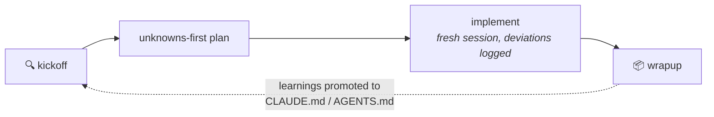

<div align="center">

# Unknown Unknowns

**`kickoff` when you start &nbsp;·&nbsp; `wrapup` when you finish &nbsp;·&nbsp; `quiz-me` when you're not sure**

Three commands that find what you don't know you don't know — before it gets expensive.

[](https://agentskills.io)
[](#claude-code)
[](#openai-codex-cli)
[](./LICENSE)

**English** · [中文](./README.zh-CN.md)

</div>

---

## The problem

> 「知之为知之，不知为不知，是知也。」
>
> *"To know what you know, and to know what you do not know — that is knowledge."*
> — Confucius, Analects 2.17

Twenty-five centuries later, this is an engineering problem. Your prompt is a map. The
codebase — with its history, conventions, and half-finished adapters — is the territory.
Wherever they differ, the agent guesses. The more work you delegate, the more it guesses.

Confucius' definition unfolds into five states, and each needs a different tool:

| State | In agentic coding | Handled by |
|---|---|---|
| Knowing what you know | what's already in your prompt | solved |
| Knowing what you don't know | questions you know to ask, still unanswered | the interview |
| Not knowing what you know | "I'll know it when I see it" | prototypes |
| Not knowing what you don't know | the pothole you never considered | the blind spot pass |
| **Believing you know what you don't** | "it's stored in Redis" (it isn't) | the premise challenge |

The last row is the state the quote itself warns against — and the one the classic 2×2
misses, because it assumes your "knowns" are true.

But there's a paradox: **the person who most needs to find their blind spots is, by
definition, the person who doesn't know they have them.** You'll never think "I'm in
the third state right now, better run the technique for it."

So this toolkit doesn't ship a taxonomy to memorize. It ships **three moments you
already feel**:

## Three moments

### 🔍 `kickoff` — "I'm about to start"

Diagnoses your unknowns, then runs **only** the techniques that fire — a blind spot
briefing for unfamiliar territory, throwaway prototypes when you'll *know it when you
see it*, a one-question-at-a-time interview for open decisions, semantics extraction
from a reference — landing on a plan you can review in five minutes.

```text
You:    /kickoff add SSO — I've never touched this app's auth module

Agent:  Two signals fired: unfamiliar territory, open decisions.
        Blind spot pass on src/auth first…

        · There's a half-finished OIDC adapter (PR #142, abandoned) — reuse or replace?
        · Sessions live in signed cookies; SSO tokens won't fit. Decision needed.
        · Question you didn't know to ask: which of the three login flows does SSO replace?

        Interviewing you next — one question at a time, architecture first.
```

If nothing fires, it says **"no meaningful unknowns — just implement"** and gets out of
the way. Kickoff is a diagnosis, not a ceremony.

### 📦 `wrapup` — "I just finished"

Packages the work into a buy-in doc that leads with the demo and answers reviewers'
objections up front. Then quizzes you on what actually changed — including the existing
code paths diffs never show — and only recommends merging on a full pass. Finally,
banks the session's surprises into permanent context.

### 🎯 `quiz-me` — "I'm not sure I understand this change"

The quiz alone: explain, test, grade strictly. Ends with an explicit
**PASS — safe to merge** or **NOT YET — misses on: <topics>**. Never softened, so you
can trust a PASS.

## The loop



What you learn becomes the map for next time.

## What's inside

The eight techniques from Thariq's
[*A Field Guide to Fable: Finding Your Unknowns*](https://x.com/trq212/article/2073100352921215386)
are all here — plus a ninth the framework logically demands: the **premise challenge**.
The unknowns matrix assumes your "knowns" are true, but the most expensive failures come
from false confidence, so kickoff also falsifies what you treat as fact.

All nine live as the agent's internal toolbox (`references/` in each skill), loaded only
when needed. You never have to name them:

| You say… | Kickoff reaches for |
|---|---|
| "I've never touched this part of the codebase" | Blind spot pass |
| "It's stored in Redis, nothing else calls it" | Premise challenge |
| "Show me options — I'll know it when I see it" | Brainstorm & throwaway prototypes |
| "Not sure this is even possible" | Feasibility spike |
| "There are decisions I haven't made" | One-question-at-a-time interview |
| "Make it work like this library" | Reference semantics extraction |
| "OK, ready to build" | Unknowns-first plan + implementation notes |

<details>
<summary><b>Peek inside the toolbox</b></summary>
<br/>

| Technique | Phase | What it does | Doc |
|---|---|---|---|
| Blind spot pass | before | Explores unfamiliar territory, briefs you on the questions you didn't know to ask, potholes, prior art, and what good looks like | [blindspot.md](./skills/kickoff/references/blindspot.md) |
| Premise challenge | before | Harvests everything treated as fact — yours and the agent's — and verifies it against the territory with evidence: CONFIRMED / FALSE / UNVERIFIABLE | [challenge.md](./skills/kickoff/references/challenge.md) |
| Brainstorm & prototypes | before | 5–10 approaches ranked cheapest → most ambitious, or 3–4 wildly different single-file HTML mockups; your reactions become explicit criteria | [brainstorm.md](./skills/kickoff/references/brainstorm.md) |
| Feasibility spike | before | Smallest experiment that yields a yes/no with measured evidence; pass/fail bar defined before running it | [brainstorm.md](./skills/kickoff/references/brainstorm.md) (Mode C) |
| Interview | before | One question at a time, biggest architectural blast radius first, each with a suggested default; ends in a paste-ready decision log | [interview.md](./skills/kickoff/references/interview.md) |
| Reference extraction | before | Reads a reference's actual source, produces a keep/adapt/drop semantics checklist before any code is written | [use-reference.md](./skills/kickoff/references/use-reference.md) |
| Unknowns-first plan | before | Most-likely-to-change decisions on top (with confidence + what would flip them); mechanical work buried at the bottom | [plan.md](./skills/kickoff/references/plan.md) |
| Implementation notes | during | Logs decisions, deviations, and surprises as they happen; conservative option + keep going — and when deviations pile up, triggers a re-diagnosis instead of patching a broken plan | [impl-notes.md](./skills/kickoff/references/impl-notes.md) |
| Pitch & explainer | after | One demo-first buy-in doc that answers reviewers' objections before they ask | [pitch.md](./skills/wrapup/references/pitch.md) |
| Understanding quiz | after | Report covering what diffs don't show, then a strictly graded quiz that gates the merge | [quiz.md](./skills/wrapup/references/quiz.md) |

</details>

Wrapup closes two loops, not one: it promotes this session's surprises into permanent
context (better map), and asks *which of these could kickoff have caught, and why
didn't it* (better map-making).

## Install

#### Claude Code

```
/plugin marketplace add lusipad/Unknown-unknowns
/plugin install unknown-unknowns@unknown-unknowns
```

#### OpenAI Codex CLI

```sh
git clone https://github.com/lusipad/Unknown-unknowns.git
cd Unknown-unknowns && ./install.sh --codex
```

Windows: `.\install.ps1 -Codex`

#### Universal (Claude Code + Codex + Cursor + more)

```sh
npx skills add lusipad/Unknown-unknowns
```

#### Manual

Each skill is a plain folder with a `SKILL.md`. Copy any folder from `skills/` into
your agent's skills directory (`~/.claude/skills/`, `~/.codex/skills/`, …).

### Optional: three always-on rules

Two things nobody remembers to trigger: keeping implementation notes mid-task, and
reviewing before merge. Opt in per project:

```sh
./install.sh --rules /path/to/your/project    # Windows: .\install.ps1 -Rules D:\your\project
```

Appends [three lines](./rules/unknowns-rules.md) to the project's
`CLAUDE.md` / `AGENTS.md` (idempotent — safe to re-run).

## Multilingual

Instructions stay in English (best model adherence), but every skill requires
user-facing output — briefings, questions, quizzes, verdicts — **in the language you're
speaking**. Triggering works in any language via semantic matching; 中文 trigger words
(开工 / 收工 / 考考我) are built into the descriptions.

## Design principles

- **Moments, not taxonomy.** People reliably feel *starting* and *finishing*; they don't
  reliably notice "I have unknown knowns." Commands map to the former; the agent handles
  the latter.
- **Progressive disclosure.** Three entry points; nine techniques as reference files
  read on demand — cheap on context until needed.
- **Portable by construction.** Frontmatter is only `name` + `description` (the open
  [Agent Skills](https://agentskills.io) format); bodies contain no agent-specific tool
  names.
- **Honest exits（不知为不知）.** When you don't know, say you don't know: "just
  implement" and "NOT YET" are first-class outcomes, not failures.

## Credits & license

Concepts from [Thariq (@trq212)](https://x.com/trq212)'s
[*A Field Guide to Fable: Finding Your Unknowns*](https://x.com/trq212/article/2073100352921215386),
and the Analects, 2.17. MIT — see [LICENSE](./LICENSE).
