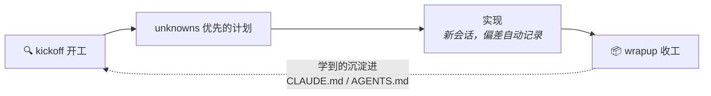

<div align="center">

# Unknown Unknowns

**「知之为知之，不知为不知，是知也。」**

—— 《论语·为政》

<br/>

开工 `kickoff` &nbsp;·&nbsp; 收工 `wrapup` &nbsp;·&nbsp; 不放心 `quiz-me`

三个命令，在代价变大之前，让你"是知也"。

[](https://agentskills.io)
[](#claude-code)
[](#openai-codex-cli)
[](./LICENSE)

[English](./README.md) · **中文**

</div>

---

## 两千年前的答案，和今天的问题

孔子给"智"下过一个定义：知道自己知道什么，也知道自己不知道什么。

和 AI 结对干活时，这句话变成了一个工程问题。你的提示词是一张**地图**，代码库——连同
它的历史、惯例、写了一半的适配器——才是**疆域**。两者不一致的地方，Agent 只能靠猜；
而它猜的每一处，都是你"不知，而不自知"的地方。你委托的工作越多，它猜得越多。

把孔子的两句拆开，再往下推两层，正好是这套工具要对付的四种状态：

| 状态 | 对应 | 谁来解决 |
|---|---|---|
| **知之为知之** | 你写进提示词里的东西 | 已经解决了 |
| **不知为不知** | 你知道还没想清楚的问题 | 访谈你，一次一个问题 |
| **知，而不自知** | "看到才知道要什么" | 出几个原型让你挑 |
| **不知，而不自知** | 完全没想到的坑 | 替你扫盲区 |

但这里有个悖论：**最需要发现盲区的人，恰恰是不知道自己有盲区的人。** 你永远不会
想到"我现在处于'知而不自知'状态，该跑对应的技巧了"。

所以这套工具不要求你背任何分类法，它只对应**三个你真切感知得到的时刻**。

## 三个时刻

### 🔍 `kickoff` —— "我要开始干活了"

先诊断你的 unknowns，然后**只跑被触发的技巧**——不熟的领域先做盲区简报；"看到才
知道要什么"就出几个一次性原型；有悬而未决的决策就一次一个问题地访谈你；有参考实现
就提炼语义清单——最后落成一份 5 分钟能审完的计划。

```text
你：    /kickoff 加 SSO——这个应用的 auth 模块我从来没碰过

Agent： 两个信号触发了：陌生领域、未决决策。
        先对 src/auth 做盲区扫描……

        · 有一个写了一半的 OIDC 适配器（PR #142，已弃）——复用还是重写？
        · 会话存在签名 cookie 里，装不下 SSO token，这里需要你做决定。
        · 一个你不知道该问的问题：三条登录流程里，SSO 替换哪一条？

        接下来访谈你——一次一个问题，先问影响架构的。
```

如果什么信号都没触发，它会直说 **"没有值得挖的 unknowns——直接实现吧"**，然后让开。
kickoff 是诊断，不是仪式。

### 📦 `wrapup` —— "活干完了"

把成果打包成 demo 开头的 buy-in 文档，提前回答评审者会问的问题；然后就真实发生的
改动（包括 diff 看不到的既有代码路径）出题考你，全对才建议合并；最后把这轮的意外
发现沉淀进永久上下文。

### 🎯 `quiz-me` —— "我不确定自己看懂了这次改动"

单独的测验：讲解、出题、严格打分。明确给出 **PASS——可以合并** 或
**NOT YET——以下主题没过**。

"不知为不知"——没看懂就承认没看懂，这正是测验存在的意义。从不放水，所以 PASS
值得信任。

## 循环



这一轮学到的，就是下一轮的地图。不知的越来越少，知的越来越实——**是知也**。

## 里面是什么

Thariq 的
[*A Field Guide to Fable: Finding Your Unknowns*](https://x.com/trq212/article/2073100352921215386)
里的九种技巧全都在——作为 Agent 的内部工具箱（每个 skill 的 `references/`），按需
加载。你永远不需要叫出它们的名字：

| 你说…… | kickoff 会拿出 |
|---|---|
| "这块代码我从来没碰过" | 盲区扫描 |
| "给我看几个方向，我看到才知道要什么" | 头脑风暴 + 一次性原型 |
| "还有些事我没想好" | 一次一个问题的访谈 |
| "照着这个库做一个" | 参考实现语义提炼 |
| "好了，可以开始建了" | unknowns 优先的计划 + 实现笔记 |

## 安装

#### Claude Code

```
/plugin marketplace add lusipad/Unknown-unknowns
/plugin install unknown-unknowns@unknown-unknowns
```

#### OpenAI Codex CLI

```sh
git clone https://github.com/lusipad/Unknown-unknowns.git
cd Unknown-unknowns && ./install.sh --codex
```

Windows：`.\install.ps1 -Codex`

#### 通用安装器（Claude Code + Codex + Cursor 等）

```sh
npx skills add lusipad/Unknown-unknowns
```

#### 手动安装

每个 skill 就是一个含 `SKILL.md` 的普通文件夹。把 `skills/` 下任意文件夹复制到你的
Agent skills 目录即可（`~/.claude/skills/`、`~/.codex/skills/`……）。

### 可选：三条常驻规则

有两件事没人会记得主动触发：干活途中记实现笔记，以及合并前做检查。按项目选择性注入：

```sh
./install.sh --rules /path/to/your/project    # Windows: .\install.ps1 -Rules D:\your\project
```

往项目的 `CLAUDE.md` / `AGENTS.md` 追加[三行规则](./rules/unknowns-rules.md)
（幂等，重复运行安全）。

## 多语言

指令正文保持英文（模型遵循度最高），但每个 skill 都明确要求：面向用户的输出——简报、
提问、测验、判定——**必须用你正在说的语言**。任何语言都能通过语义匹配触发；中文触发词
（开工 / 收工 / 考考我）已内置在 description 里。

## 设计原则

- **按时刻划分，不按分类法划分。** 人人都能感知"要开始了"和"干完了"，但没人能察觉
  自己"知而不自知"。命令对应前者，后者交给 Agent。
- **渐进式披露。** 3 个入口，9 种技巧作为参考文档按需读取——不用时不占上下文。
- **天生可移植。** Frontmatter 只有 `name` + `description`（开放的
  [Agent Skills](https://agentskills.io) 格式），正文不含任何特定 Agent 的工具名。
- **不知为不知。** "直接实现吧"和 "NOT YET" 是一等公民的结论，不是失败——诚实的
  出口本身就是这套工具的核心主张。

## 致谢与许可

理念来自 [Thariq (@trq212)](https://x.com/trq212) 的
[*A Field Guide to Fable: Finding Your Unknowns*](https://x.com/trq212/article/2073100352921215386)，
以及《论语·为政》。MIT——见 [LICENSE](./LICENSE)。
